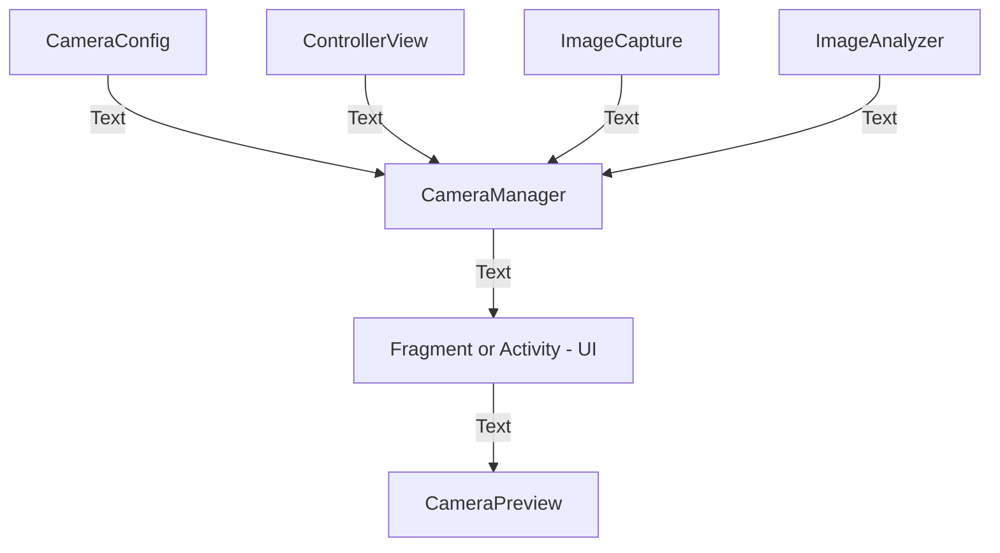

# CameraX library for Android

----
## what is CameraX?

This library's base on Android CameraX library (Jetpack support library). It help you to make camera application with functions preview and capture or analyzer become easier, faster.

----

## Usage
----
### Sequence diagram

----
