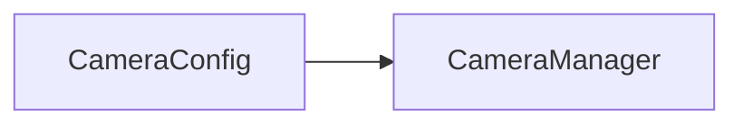

"# CameraXLibrary" 

----
## what is CameraX?

This library's base on Android CameraX library (Jetpack support library). It help you to make camera application with functions preview and capture or analyzer become easier, faster.

----
## Usage


CameraConfig->CameraManager: Hello Bob, how are you?
ControllerView->CameraManager: Hello Bob, how are you?
ImageCapture->CameraManager: Hello Bob, how are you?
ImageAnalyzer->CameraManager: Hello Bob, how are you?
CameraManager->Fragment (or Activity): Hello Bob, how are you?
Fragment(orActivity)->CameraPreview: show preview on CameraPreview
```


1. Write markdown text in this textarea.
2. Click 'HTML Preview' button.

----
## markdown quick reference
# headers

*emphasis*

**strong**

* list

>block quote

    code (4 spaces indent)
[links](https://wikipedia.org)

----
## changelog
* 17-Feb-2013 re-design

----
## thanks
* [markdown-js](https://github.com/evilstreak/markdown-js)
